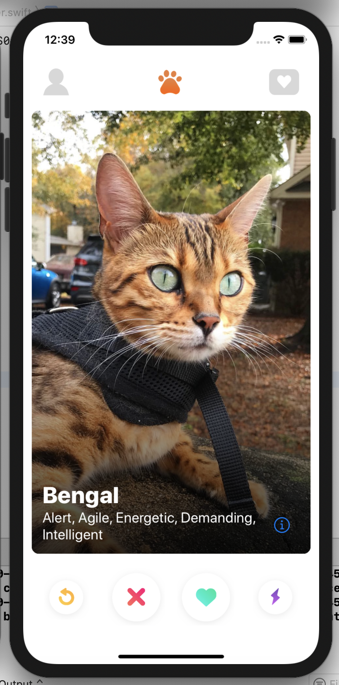
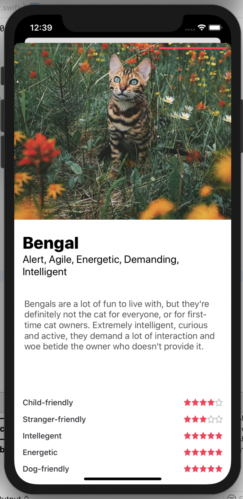
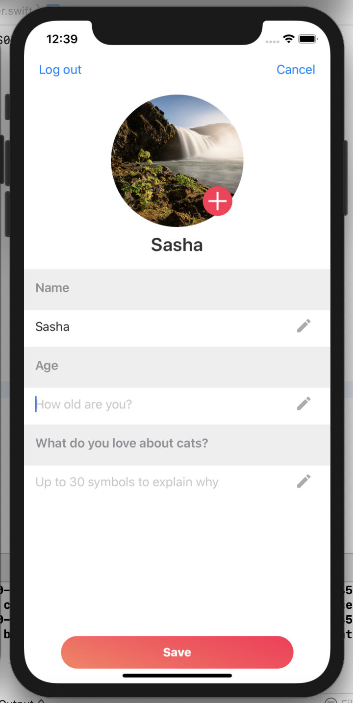
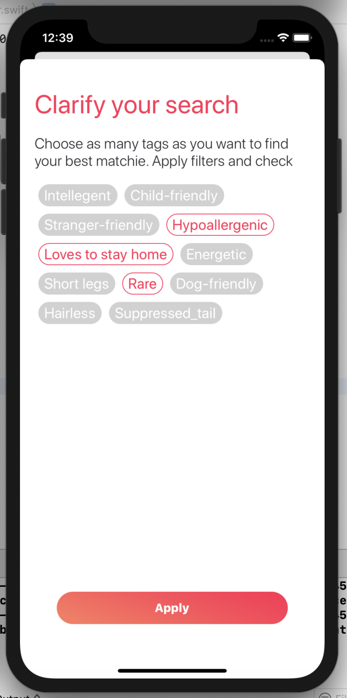

# kotyky

Welcome cat lovers!
Seeking out your perfect fluffy roommate? Well, look no further, this will help you choose amoung dozens and dozens breeds.

The app UI was inspired by Tinder, one of the most popular dating app in the world. 

The main flow stays the same: swipe right if you like the cat or swipe left if you're looking for another one.

You can shuffle your card deck.

You can check out your favourites.

You can adjust your search by adding filters (such as "dog-friendly", "child-friendly" and many more).

<p align="center">
  
  
  
  
</p>

## Getting Started

First and foremost

```
Download the proj
```

Then

```
Open it with Xcode (yay)
```

Important:

```
Ensure you run the app on your iPhone! 
(otherwise you won't experience the marvel of touches and swipes our smartphones kindly provide us).
And yes, simulators tend to behave rather strange sometimes.
```

So here we are

```
Experience the app
```

## Built With

The images and breeds were kindly provided by:

* [CatAPI](https://docs.thecatapi.com)

## The app features

Customized views
UI from code
MVP / MVVM kinda architecture
Working with API
UserDefaults 
Localization
Dark mode and many more!


